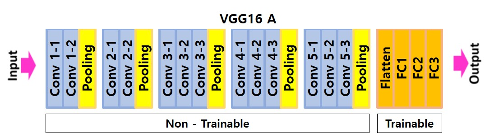
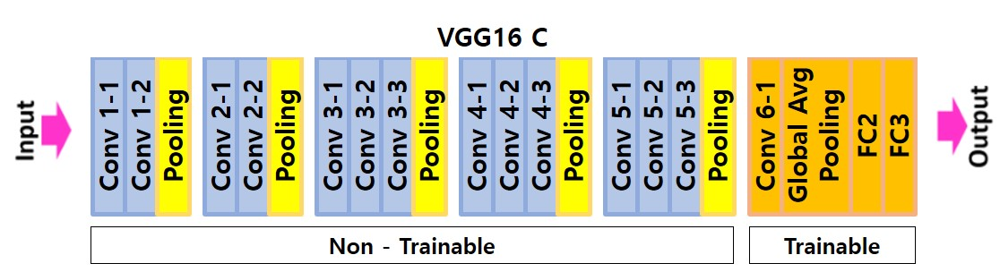
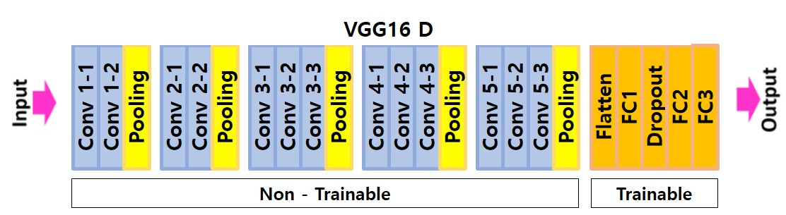

## DeepLearning Project

- 학습 모델
  - VGG16 vs ResNet50 성능비교 → VGG16 채택
    - VGG16_A : 사전훈련된 가중치 이용, fine tuning X
    - VGG16_B : 사전훈련된 가중치 이용, fine tuning O
    - VGG16_C : VGG16_A + Global Average Pooling 이용
    - VGG16_D : VGG16_A + Dropout 이용

